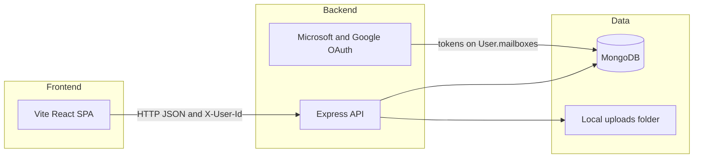

# GovFlow — System documentation (Database, Backend, Frontend)

This document describes the **MongoDB** data layer, **Node.js/Express** API, and **Vite + React** frontend for the GovFlow workspace (`test-govflow`). It is intended for developers and operators deploying or extending the system.

---

## 1. High-level architecture



- **Frontend** (`gov-flow-ui-files-ref/`): Single-page app; talks to the API via `fetch` with `VITE_API_BASE_URL` and optional `X-User-Id` (dev-style auth).
- **Backend** (`backend/`): REST-ish JSON API, session cookies for OAuth state, static `/uploads` for avatars.
- **Database**: MongoDB accessed through **Mongoose**; most collections include a string `tenantId` (currently `default` via `DEFAULT_TENANT_ID`).

---

## 2. Database (MongoDB)

### 2.1 Connection

| Item | Location |
|------|----------|
| Connection string | `MONGO_URI` in [`backend/.env`](backend/.env) (see [`backend/.env.example`](backend/.env.example)) |
| Driver | Mongoose 8.x |
| Bootstrap | [`backend/src/lib/db.js`](backend/src/lib/db.js) — `connect()` on server start; in non-production, server may start even if DB fails (health still reports status) |

### 2.2 Collections / models

Models are registered in [`backend/src/models/index.js`](backend/src/models/index.js). Each document typically uses a **string `id`** field (not only MongoDB `_id`) for compatibility with the frontend/mock data.

| Model | File | Purpose |
|-------|------|---------|
| `User` | [`models/User.js`](backend/src/models/User.js) | Users, roles, embedded `mailboxes` (OAuth tokens), `notification_preferences` |
| `Department` | [`models/Department.js`](backend/src/models/Department.js) | Departments / org hierarchy |
| `TeamMember` | [`models/TeamMember.js`](backend/src/models/TeamMember.js) | Team membership |
| `Task` | [`models/Task.js`](backend/src/models/Task.js) | Initiatives/tasks; `source_email_id` links to email |
| `Subtask` | [`models/Subtask.js`](backend/src/models/Subtask.js) | Subtasks under a task |
| `Comment` | [`models/Comment.js`](backend/src/models/Comment.js) | Comments on tasks or other entities |
| `TaskApproval` | [`models/TaskApproval.js`](backend/src/models/TaskApproval.js) | Approval workflow records |
| `TaskDependency` | [`models/TaskDependency.js`](backend/src/models/TaskDependency.js) | Task dependency graph |
| `WorkflowStage` | [`models/WorkflowStage.js`](backend/src/models/WorkflowStage.js) | Kanban / workflow columns |
| `EmailMessage` | [`models/EmailMessage.js`](backend/src/models/EmailMessage.js) | Synced inbox messages; `attachments` metadata |
| `RoutingRule` | [`models/RoutingRule.js`](backend/src/models/RoutingRule.js) | Email routing rules |
| `Notification` | [`models/Notification.js`](backend/src/models/Notification.js) | In-app notifications |
| `NotificationPreference` | [`models/NotificationPreference.js`](backend/src/models/NotificationPreference.js) | Per-user notification settings (extended fields) |
| `RolePageAccess` | [`models/RolePageAccess.js`](backend/src/models/RolePageAccess.js) | RBAC page access |
| `RolePermission` | [`models/RolePermission.js`](backend/src/models/RolePermission.js) | RBAC permission rows |

**Multi-tenancy note:** `tenantId` appears on many schemas; services often filter with `config.defaultTenantId` (see [`backend/src/config/index.js`](backend/src/config/index.js) `DEFAULT_TENANT_ID`).

**Key relations (logical):**

- `Task.lead_user_id` → `User.id`
- `Task.source_email_id` → `EmailMessage.id`
- `EmailMessage.linked_task_id` (optional) ↔ task
- `User.mailboxes[]` — OAuth-connected Outlook/Gmail mailboxes with tokens stored server-side

---

## 3. Backend (Node.js + Express)

### 3.1 Runtime and entrypoints

| Item | Value |
|------|--------|
| Entry | [`backend/src/server.js`](backend/src/server.js) — connects DB, listens on `PORT` |
| App | [`backend/src/app.js`](backend/src/app.js) — middleware + route mounting |
| Start script | `npm start` → `node src/server.js` |

### 3.2 Configuration (environment)

| Variable | Purpose |
|----------|---------|
| `PORT` | HTTP port (default `5000`) |
| `MONGO_URI` | MongoDB connection string |
| `JWT_SECRET` | Dev/legacy token signing (see config) |
| `DEFAULT_TENANT_ID` | Default tenant string |
| `UPLOADS_DIR` | Directory for uploaded files (avatars) |
| `CORS_ORIGINS` | Comma-separated allowed browser origins |
| `SESSION_SECRET` | Express-session secret (OAuth state) |
| `FRONTEND_URL` | Used for OAuth redirects after Microsoft/Google callback |
| `MICROSOFT_*` | Azure AD app + Graph scopes for Outlook |
| `GOOGLE_*` | Google OAuth + Gmail scopes |

Full list and examples: [`backend/.env.example`](backend/.env.example). Runtime config object: [`backend/src/config/index.js`](backend/src/config/index.js).

### 3.3 Middleware stack (order)

1. **CORS** — `credentials: true`, headers include `X-User-Id`
2. **JSON / urlencoded** — body size limit 10mb
3. **express-session** — OAuth state (`secure: false` in dev; set `true` behind HTTPS in production)
4. **Static** — `/uploads` from `UPLOADS_DIR`
5. **morgan** — request logging
6. **attachUser** — [`middleware/auth.js`](backend/src/middleware/auth.js): resolves user from `X-User-Id` or `Authorization: Bearer <userId>` (dev-oriented)
7. **Routes**
8. **404** JSON
9. **errorHandler**

### 3.4 Authentication model (current)

- Not a full JWT login for all routes: the API expects **`X-User-Id`** (or Bearer token equal to user id) for `requireAuth` routes, plus dev login at `POST /auth/dev-login` returning a token.
- **OAuth** (Microsoft/Google): user authorizes; callback stores mailbox + tokens on `User.mailboxes` and redirects to `FRONTEND_URL` (e.g. `/Settings` with query params).

### 3.5 HTTP API surface (summary)

Routes are mounted at **root** unless prefixed (e.g. `/auth`, `/health`).

| Area | Method | Path prefix / examples |
|------|--------|-------------------------|
| Health | GET | `/health` |
| Auth | GET | `/auth/public-settings`, `/auth/me` |
| Auth | POST | `/auth/dev-login`, `/auth/logout` |
| Auth | PATCH | `/auth/me` (profile, `mailboxes`, `notification_preferences`) |
| Auth | POST | `/auth/avatar` (multipart) |
| Microsoft | POST | `/auth/microsoft/authorize-url` |
| Microsoft | GET | `/auth/microsoft/callback`, `/status`, `/inbox`, `/sync-inbox`, … |
| Google | POST | `/auth/google/authorize-url` |
| Google | GET | `/auth/google/callback`, `/status`, `/sync-inbox`, … |
| Tasks | CRUD | `/tasks`, `/tasks/:id` |
| Subtasks | | `/tasks/:id/subtasks`, `/subtasks`, `/subtasks/:id` |
| Comments | | `/comments?entityType=&entityId=` |
| Task deps | | `/task-dependencies` |
| Emails | | `/emails`, `/emails/:id` |
| Departments | | `/departments`, … (see [`departmentsRoutes.js`](backend/src/routes/departmentsRoutes.js)) |
| Workflow | | `/workflow-stages`, `/workflow-stages/bulk`, … |
| Notifications | | `/notifications?userId=`, `/notifications/:id/read` |
| Notification prefs | | `/notification-preferences`, `/notification-preferences/list`, … ([`notificationPreferencesRoutes.js`](backend/src/routes/notificationPreferencesRoutes.js)) |
| RBAC | | `/role-page-access`, `/role-permissions` |
| Approvals | | `/approvals` (see [`approvalsRoutes.js`](backend/src/routes/approvalsRoutes.js)) |
| Analytics | | `/analytics` (see [`analyticsRoutes.js`](backend/src/routes/analyticsRoutes.js)) |
| Routing rules | | `/routing-rules` (see [`routingRulesRoutes.js`](backend/src/routes/routingRulesRoutes.js)) |
| Users | | `/users`, `/users/:id`, `/users/:id/role`, `/users/invite` |

Exact paths are defined in each file under [`backend/src/routes/`](backend/src/routes/).

### 3.6 Services layer

Business logic lives in [`backend/src/services/`](backend/src/services/) (e.g. `tasksService.js`, `emailService.js`, `notificationsService.js`, `taskAssignmentNotifications.js`, `microsoftGraphService.js`, `googleGmailService.js`). Routes stay thin.

### 3.7 Static files and uploads

- Avatars and similar uploads: `POST /auth/avatar` → stored under `UPLOADS_DIR`, served at **`GET /uploads/<filename>`**.

---

## 4. Frontend (Vite + React)

### 4.1 Location and stack

| Item | Path |
|------|------|
| App | [`gov-flow-ui-files-ref/`](gov-flow-ui-files-ref/) |
| Bundler | Vite 6 + `@vitejs/plugin-react` |
| Aliases | `@` → `src/` ([`vite.config.js`](gov-flow-ui-files-ref/vite.config.js)) |
| Routing | `react-router-dom` — [`App.jsx`](gov-flow-ui-files-ref/src/App.jsx) |
| Data | TanStack Query (`@tanstack/react-query`) |
| UI | Tailwind + Radix/shadcn-style components under `src/components/ui/` |

### 4.2 Environment variables

See [`gov-flow-ui-files-ref/.env.example`](gov-flow-ui-files-ref/.env.example):

| Variable | Purpose |
|----------|---------|
| `VITE_API_BASE_URL` | Base URL of the Node API (e.g. `http://localhost:5000`) |
| `VITE_USE_NODE_BACKEND` | When `true` (or with `VITE_API_BASE_URL` set), API modules use the Node client |
| `VITE_DEV_USER_ID` | Default user id sent as `X-User-Id` in dev |
| `VITE_BASE44_*` | Optional legacy Base44 SDK (when Node backend disabled) |

HTTP client: [`src/api/nodeBackendClient.js`](gov-flow-ui-files-ref/src/api/nodeBackendClient.js) — sends `X-User-Id`, `credentials: 'include'` for session cookies.

### 4.3 Pages and routing

- **Layout** and **page registry**: [`src/pages.config.js`](gov-flow-ui-files-ref/src/pages.config.js) — `PAGES` maps route keys to components; `mainPage` is **MyDashboard**; `Layout` wraps authenticated routes.
- **URL pattern**: `/<PageKey>` e.g. `/Tasks`, `/TaskDetail?id=...` (see [`src/utils/index.ts`](gov-flow-ui-files-ref/src/utils/index.ts) `createPageUrl`).
- **Login** is **not** in `pages.config` — it is a dedicated route in [`App.jsx`](gov-flow-ui-files-ref/src/App.jsx) (`/login`).

### 4.4 API modules (`src/api/`)

| Module | Role |
|--------|------|
| `authApi.js` | `getCurrentUser`, `updateMe`, `signIn`, `getAppPublicSettings`, avatar upload |
| `tasksApi.js` | Tasks, subtasks, comments, dependencies |
| `emailApi.js` | Email messages |
| `notificationsApi.js` | Notifications |
| `usersApi.js` | Users |
| `departmentsApi.js`, `workflowApi.js`, `rbacApi.js`, `routingRulesApi.js`, `approvalsApi.js`, `analyticsApi.js` | Domain APIs |
| `outlookApi.js` / `googleApi.js` | OAuth start URLs and status |

### 4.5 Notable UI features

- **Layout** ([`Layout.jsx`](gov-flow-ui-files-ref/src/Layout.jsx)): sidebar nav, notification bell + [`NotificationCenter`](gov-flow-ui-files-ref/src/components/shared/NotificationCenter.jsx), [`AssignmentToastListener`](gov-flow-ui-files-ref/src/components/shared/AssignmentToastListener.jsx) for assignment toasts.
- **Auth context**: [`lib/AuthContext.jsx`](gov-flow-ui-files-ref/src/lib/AuthContext.jsx) loads public settings + current user.
- **Email**: [`EmailInbox.jsx`](gov-flow-ui-files-ref/src/pages/EmailInbox.jsx), [`MailboxSelector`](gov-flow-ui-files-ref/src/components/email/MailboxSelector.jsx), OAuth flows from Settings.

### 4.6 Build and preview

```bash
cd gov-flow-ui-files-ref
npm run build    # output: dist/
npm run preview  # local preview of production build
```

Point `VITE_API_BASE_URL` at the deployed API origin in production builds.

---

## 5. Cross-cutting concerns

### 5.1 CORS and cookies

- `CORS_ORIGINS` must include the exact SPA origin (scheme + host + port).
- OAuth flows rely on **session cookies** between browser and API; same-site and HTTPS settings must be correct in production.

### 5.2 Security notes (production checklist)

- Replace dev secrets (`JWT_SECRET`, `SESSION_SECRET`).
- Use **HTTPS** everywhere; set `cookie.secure: true` for sessions when appropriate.
- Restrict MongoDB network access (IP allowlist / private network).
- Review OAuth redirect URIs in Azure and Google consoles for production URLs.

### 5.3 Related docs in repo

- [`gov-flow-ui-files-ref/docs/API_CONTRACT.md`](gov-flow-ui-files-ref/docs/API_CONTRACT.md) — API notes (if present and maintained).

---

## 6. Revision

| Item | Value |
|------|--------|
| Document | `docs/GOVFLOW_SYSTEM_DOCUMENTATION.md` |
| Workspace root | `test-govflow` |

Update this file when you add new routes, models, or environment variables.
